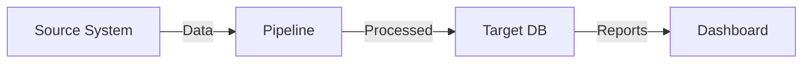

# PROJECT TEMPLATE

## Frontmatter (keep this format)
```yaml
---
title: "Project Title"
year: 2019
phase: "Your Role/Phase"
description: "One-line summary of what this project is about"
sidebar:
  - label: "Architectural Pattern"
    value: "Microservices"
  - label: "Technologies"
    value: "React, Node.js, PostgreSQL"
  - label: "Team Size"
    value: "5 Engineers"
---
```
**Important:** 
- Do NOT include a `layout` field - the dynamic route handles that.
- The `sidebar` field is **optional**. Omit it if you don't want a sidebar for this project.

## Markdown Structure (follow this exactly)

### 1. Impact Metrics (First Section)
Start with metrics in this format:
```
## Impact
2w → 3d | Release Cycle
1000+ | Jobs Migrated
85% | Automation Rate
100% | Uptime (Hybrid)
```

The layout will render as 4 big blue metric cards.

### 2. Overview
```
## Overview
Write a 2-3 sentence summary of the project and its significance.
```

### 3. The Problem
```
## The Problem

### Scale
- Bullet point 1
- Bullet point 2
- Bullet point 3

### Key Challenges

### Challenge 1: Title
**Issue:** What was the problem?
**Solution:** How did you solve it?

### Challenge 2: Title
**Issue:** Problem description
**Solution:** Solution description

### Challenge 3: Title
**Issue:** Problem description
**Solution:** Solution description
```

The layout will render challenges as numbered cards with red/green boxes.

### 4. Architecture/Solution
```
## Architecture (or: Solution, or: How I Overcame It)

[Description of architecture/approach]

### Custom Tags (optional)
tag1 | tag2 | tag3 | tag4 | tag5

[More details about the solution]
```

Tags render as blue badge pills.

### 5. Results & Impact
```
## Results & Impact

### Metrics
14x | Faster Releases
1000+ | Jobs Running
100% | Uptime

### Business Outcomes
- **Outcome 1:** Description
- **Outcome 2:** Description
- **Outcome 3:** Description

### Technical Outcomes
- **Outcome 1:** Description
- **Outcome 2:** Description
```

Metrics with pipes render as cards. Bold outcomes render as styled list items.

### 6. Key Learnings
```
## Key Learnings
- **Learning 1:** Description of the learning
- **Learning 2:** Description
- **Learning 3:** Description
```

### 7. Architect Reflection
```
## Architect Reflection
Write a personal reflection on what this project taught you as an architect.
Typically 2-3 paragraphs.
```

## Sidebar Options (Examples)

The sidebar is optional and can include any information relevant to your project:
```yaml
sidebar:
  - label: "Architectural Pattern"
    value: "Microservices"
  - label: "Technologies"
    value: "React, Node.js, AWS"
  - label: "Duration"
    value: "6 months"
  - label: "Team Size"
    value: "5 Engineers"
  - label: "Status"
    value: "Launched"
```

## Format Rules

1. **Metrics format:** `VALUE | Label` (pipe-separated)
2. **Issue/Solution:** Use `**Issue:**` and `**Solution:**` bold markers
3. **Challenge headers:** `### Challenge N: Title`
4. **Tags:** Pipe-separated on their own line: `tag1 | tag2 | tag3`
5. **Bold outcomes:** `- **Title:** Description`
6. **Sidebar:** Optional array of label/value pairs (displays on the right side)

## Color Coding (Automatic)
- Red boxes: Sections with `**Issue:**`
- Green boxes: Sections with `**Solution:**`
- Blue cards: Metrics and tags
- Blue accent: Outcome titles

## Mermaid Diagrams (Supported)

You can embed Mermaid diagrams directly in markdown for architecture diagrams, flowcharts, etc.

### Example: Architecture Diagram
```markdown
## Architecture


```

### Supported Diagram Types
- **Flowchart:** `graph TD` or `graph LR` (top-down or left-right)
- **Sequence Diagram:** `sequenceDiagram` (for API flows)
- **Class Diagram:** `classDiagram` (for architecture)
- **State Diagram:** `stateDiagram-v2` (for workflows)
- **Gantt Chart:** `gantt` (for timelines)

### Tips
- Mermaid diagrams render with dark theme automatically
- Keep diagram text concise for readability
- Use meaningful labels for nodes/flows
- Works perfectly on GitHub Pages (client-side rendering)

## Example Project Structure
```
---
title: "Control-M to Apache Airflow Migration"
year: 2019
phase: "DevOps/Data Engineer"
description: "Migrated 1000+ jobs from legacy Control-M to Apache Airflow"
---

## Impact
2w → 3d | Release Cycle
1000+ | Jobs Migrated
85% | Automation
100% | Uptime (Hybrid)

## Overview
[Your overview text]

## The Problem
...
```

Now just add new .md files following this structure and the Astro layout handles everything!
