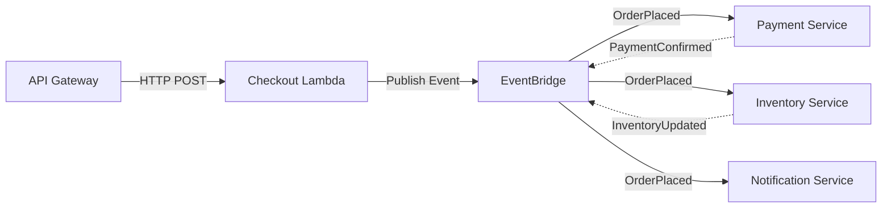

## Impact
80% | Cost Reduction  
300ms | Average Latency (down from 2.5s)  
99.99% | Uptime SLA Achieved  
0 | Maintenance Downtime

## Overview
Project Alpha involved breaking down a 10-year-old monolithic application into a modern, event-driven serverless architecture. By leveraging AWS Lambda, DynamoDB, and EventBridge, we created a system that scales infinitely while drastically reducing idle infrastructure costs.

## The Problem

### Scale & Performance
- **High Traffic Spikes:** The legacy system crashed during seasonal sales.
- **Tight Coupling:** A failure in the payment module brought down the entire inventory system.
- **Slow Deployments:** Releases took 4 hours and required manual QA sign-offs.

### Challenge 1: Unmaintainable Codebase
**Issue:** The monolith had over 1 million lines of code. Making a simple UI change often resulted in unexpected bugs in the backend logic.

**Solution:** Implemented the Strangler Fig pattern. We carved out the authentication and inventory services first, routing traffic via API Gateway.

### Challenge 2: Synchronous Blocking
**Issue:** The checkout process was highly synchronous. The user had to wait for inventory deduction, payment processing, and email generation to complete sequentially.

**Solution:** Introduced an event-driven architecture using AWS EventBridge to decouple these processes.

## Solution: Event-Driven Serverless Platform

### Configuration & Infrastructure as Code
We utilized AWS CDK (Cloud Development Kit) to define our infrastructure programmatically.

- 100% reproducible environments (Dev, Staging, Prod)
- Automated rollbacks on failed health checks
- Infrastructure stored in Git

```json
{
  "Type": "AWS::Events::Rule",
  "Properties": {
    "EventBusName": "ecommerce-main-bus",
    "EventPattern": {
      "source": ["ecommerce.checkout"],
      "detail-type": ["OrderPlaced"]
    },
    "Targets": [
      {
        "Id": "InventoryService",
        "Arn": "arn:aws:lambda:us-east-1:123456789012:function:InventoryDeduction"
      }
    ]
  }
}
```

### New Event-Driven Architecture



### Microservices Built
| Service | Technology Stack | Description |
|---|---|---|
| **Checkout Engine** | Node.js / Lambda | Handles initial cart validation and publishes events. |
| **Payment Gateway** | Python / Fargate | Securely communicates with Stripe/PayPal. |
| **Inventory Manager** | Go / DynamoDB | High-throughput transactional database for stock levels. |
| **Notification Hub** | AWS SNS / SES | Handles SMS and Email dispatch asynchronously. |

## Results & Impact
4h → 15m → Release Time  
50+ → Microservices Deployed  
$10k/mo → Savings  

### Business Outcomes
- **⚡ Faster Time to Market:** Feature teams can now deploy independently without coordination overhead.
- **📈 Black Friday Ready:** The system auto-scaled to handle a 500% increase in traffic without breaking a sweat.

## Architect Reflection
This migration highlighted the importance of Domain-Driven Design (DDD). The hardest part was not the technology, but properly defining the bounded contexts between services. Ultimately, decoupling the architecture allowed the business to scale both its application and its engineering teams simultaneously.
