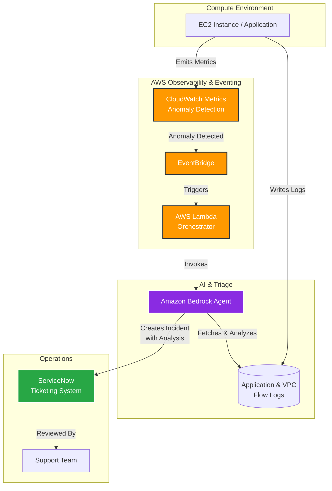

## The Challenge

Whenever an application hosted in a compute environment fails, the support team historically has to manually dig into application logs to figure out the issue. This process is inherently reactive, resulting in longer mean time to resolution (MTTR) and requiring engineers to perform tedious manual root cause analysis before any action can be taken.

## Solution Architecture

To shift from a reactive to a proactive support model, I designed an event-driven AIOps pipeline. The system uses AWS native services to detect anomalies and orchestrates an Amazon Bedrock Agent to perform the initial triage and ticketing.

## Implementation Details

1. **Anomaly Detection**: Enabled CloudWatch Anomaly Detection on key application metrics (e.g., CPU utilization, error rates). When a metric falls outside the expected baseline band, a CloudWatch Alarm state changes.
2. **Event Routing**: Amazon EventBridge captures the CloudWatch Alarm state change and routes the event to an AWS Lambda function.
3. **AI Orchestration**: The Lambda function acts as a lightweight orchestrator, passing the anomaly context (timestamp, affected resource, metric) to an Amazon Bedrock Agent.
4. **Automated Triage**: 
   - The Bedrock Agent is equipped with tools (Action Groups) to query CloudWatch Logs and VPC Flow Logs.
   - It intelligently searches for errors or unusual patterns around the timestamp of the anomaly.
   - It synthesizes a natural language summary of the potential root cause based on the log evidence.
5. **Ticketing Integration**: The agent automatically creates a ServiceNow ticket via an API integration, attaching its analysis and the relevant log snippets.

## Business Outcomes

- **Proactive Incident Management**: Issues are detected and triaged before users report them.
- **Reduced MTTR**: Support teams receive tickets that already contain the root cause analysis and log evidence, skipping the tedious investigation phase.
- **Focused Engineering**: Engineers can quickly determine if the issue is actionable or passive, freeing up time for feature development.

*Note: This architecture was successfully implemented for a single EC2 instance as a proof of concept to validate the feasibility of autonomous triage prior to large-scale rollout.*
